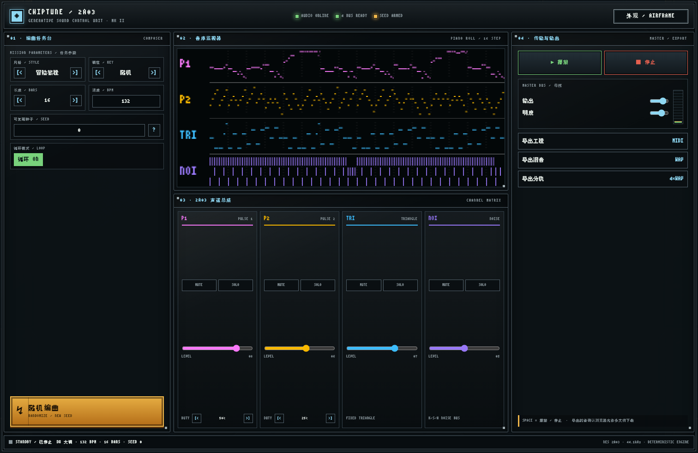

# CHIPTUNE — 8-BIT 音乐产生器

单文件、零依赖、零网络请求的 NES(红白机) 2A03 四声道音乐生成器，采用一屏工业控制台界面。
打开 `index.html` 即可使用，或直接在线试玩：

**▶ https://djzoom.github.io/chiptune/**

## 特性

- **2A03 四声道实时合成**（Web Audio API, 不加载任何采样）
  - PULSE 1 / PULSE 2：傅里叶系数构造方波，占空比 12.5% / 25% / 50% 可选
  - TRIANGLE：三角波贝斯，还原硬件无音量包络特性
  - NOISE：白噪声 + 滤波/包络，区分底鼓、军鼓、踩镲
- **种子可复现作曲**：全部随机决策来自 `mulberry32(seed)`。
  相同「风格 + 调性 + 小节数 + BPM + 种子」永远逐音符生成同一首曲子
- **六种风格**：冒险旅程 / 战斗 / 村庄日常 / 地城神秘 / 哀伤 / 魔王战
  （各自定义音阶调式、和弦进行池、旋律跳进概率、节奏密度、鼓型、BPM 区间）
- **作曲流程**：和弦进行 → PULSE 2 琶音 → PULSE 1 动机 A A' B A' 变奏 →
  TRIANGLE 根音/五音贝斯 → NOISE 风格鼓型
- **导出**（纯 JS 手写字节流）
  - MIDI：SMF Type-1，四轨 + tempo，Logic / GarageBand 直接打开
  - WAV：混音整曲 + 四轨分轨，OfflineAudioContext 渲染，16-bit PCM 44.1kHz
- **可视化**：Canvas 像素化钢琴卷帘，播放头与声音同步，磷光余辉效果
- **一屏工业控制台**：按编曲、监视、声道、母线/导出分区，手机竖屏、手机横屏与 MacBook Pro 均无需页面滚动
- **专业混音控制**：四轨独立音量、Mute、Solo；母线输出、滤波明度与实时电平表
- **三套机械框架**（右上角“外观”键循环切换）
  - AIRFRAME：冷灰航空仪表板
  - DIESEL ARMOR：厚重黄铜与柴油朋克装甲边框
  - STEAM BRASS：双线铜框、圆形铆钉与蒸汽朋克配色

## 操作

- 空格键 = 播放 / 停止；大型“随机编曲”键是唯一随机入口；`?` 查看可复现说明
- 每轨独立音量推子、Mute 与 Solo；母线推子会同步影响实时播放与 WAV 导出
- DAW 后期：导入 MIDI 后挂 chiptune 音源（如免费的 Magical 8bit Plug 2），
  或把四轨分轨 WAV 拉进 DAW 做 EQ / 压缩 / 残响

## 内嵌像素字体

页面内嵌一个子集化 woff2（约 13KB，保持零网络请求）：

| 字体 | 来源 | 用途 | 许可 |
|---|---|---|---|
| FusionPixel12 | [MisekiBitmap](https://github.com/TakWolf/miseki-bitmap-font)（缝合像素字体 12px 简中源，11×11 点阵） | 全站（含界面框线与卷帘标签） | SIL OFL 1.1 |

## License

代码 MIT（见 LICENSE）。内嵌字体子集保留其原许可。
